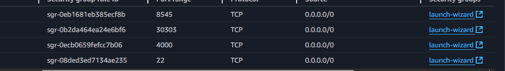

created a ec2 instance 
Type	Protocol	Port Range	Source	Description
SSH	TCP	22	Your IP or 0.0.0.0/0	Admin Access
Custom TCP	TCP	30303	0.0.0.0/0 or VPC CIDR	Ethereum P2P
Custom TCP	TCP	8545	0.0.0.0/0 or trusted IPs	Ethereum RPC
Custom TCP	TCP	4000	0.0.0.0/0 or trusted IPs	App Port  

this is the sg

